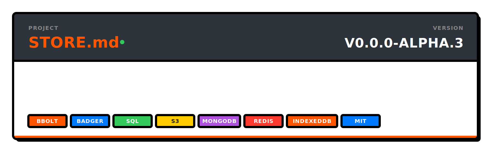

<p align="center">
  
</p>

<p align="center">
  <code>go get github.com/readmedotmd/store.md</code>
</p>

---

## What is this?

A **single key-value interface** with **seven swappable backends** and a **built-in sync engine** for peer-to-peer replication.

Write your code against one interface. Swap the backend without changing a line.

```go
type Store interface {
    Get(ctx context.Context, key string) (value string, err error)
    Set(ctx context.Context, key, value string) (err error)
    Delete(ctx context.Context, key string) (err error)
    List(ctx context.Context, args ListArgs) (result []KeyValuePair, err error)
}
```

---

## Backends

<table>
<tr>
<td width="150"><strong>BBolt</strong></td>
<td>Embedded B+ tree. Single file. Zero config.</td>
<td><code>backend/bbolt/</code></td>
</tr>
<tr>
<td><strong>Badger</strong></td>
<td>LSM-tree. SSD-optimized. High throughput.</td>
<td><code>backend/badger/</code></td>
</tr>
<tr>
<td><strong>SQL</strong></td>
<td>Any SQL database. Tested with SQLite (pure Go).</td>
<td><code>backend/sql/</code></td>
</tr>
<tr>
<td><strong>S3</strong></td>
<td>S3-compatible (AWS, MinIO, R2). Cloud-native storage.</td>
<td><code>backend/s3/</code></td>
</tr>
<tr>
<td><strong>MongoDB</strong></td>
<td>Document store. Atlas or self-hosted.</td>
<td><code>backend/mongodb/</code></td>
</tr>
<tr>
<td><strong>Redis</strong></td>
<td>In-memory. Fast reads. Shared state.</td>
<td><code>backend/redis/</code></td>
</tr>
<tr>
<td><strong>IndexedDB</strong></td>
<td>Browser-native. WASM. Offline-first.</td>
<td><code>backend/indexeddb/</code></td>
</tr>
</table>

> [Detailed backend documentation &rarr;](./docs/implementations.md)

---

## Quick Start

```bash
go get github.com/readmedotmd/store.md
go get github.com/readmedotmd/store.md/backend/bbolt
```

```go
package main

import (
    "context"
    "errors"
    "fmt"

    storemd "github.com/readmedotmd/store.md"
    "github.com/readmedotmd/store.md/backend/bbolt"
)

func main() {
    store, _ := bbolt.New("data.db")
    defer store.Close()

    ctx := context.Background()

    store.Set(ctx, "hello", "world")

    val, err := store.Get(ctx, "hello")
    if errors.Is(err, storemd.ErrNotFound) {
        fmt.Println("not found")
        return
    }
    fmt.Println(val) // world
}
```

> [Full getting started guide &rarr;](./docs/getting-started.md)

---

## Sync Engine

Built-in peer-to-peer synchronization with **last-write-wins conflict resolution**.

```go
import (
    "context"

    "github.com/readmedotmd/store.md/sync/core"
)

ctx := context.Background()
ss := core.New(store)
defer ss.Close()

// Write data
ss.SetItem(ctx, "myapp", "config", `{"theme":"dark"}`)

// Sync with a peer
outgoing, _ := ss.Sync(ctx, "peer-2", nil)        // initiate
response, _ := peer.Sync(ctx, "peer-1", outgoing) // peer processes and responds
```

The unified `Sync` method handles both sending and receiving. The `core.StoreSync` implementation uses queue-based incremental sync with timestamp conflict resolution. It implements the `SyncStore` interface and works with the server and client packages. Call `Close()` on sync stores when done to release resources cleanly.

> [Sync documentation &rarr;](./docs/sync.md)

---

## Sync Server

WebSocket server for syncing stores over the network. Accepts any `core.SyncStore` (`StoreSync` or `StoreMessage`). Run standalone or plug into an existing HTTP server.

```go
import (
    "github.com/readmedotmd/store.md/backend/bbolt"
    "github.com/readmedotmd/store.md/sync/core"
    "github.com/readmedotmd/store.md/sync/server"
)

store, _ := bbolt.New("data.db")
ss := core.New(store)
defer ss.Close()

srv := server.New(ss, server.TokenAuth(map[string]string{
    "secret-token-1": "peer-1",
    "secret-token-2": "peer-2",
}))

srv.ListenAndServe(":8080")
```

Or mount on an existing mux:

```go
mux.Handle("/sync", srv)
```

The server delegates all sync protocol handling to the client adapter. When a peer pushes data, the server automatically broadcasts a `sync_update` notification to all other connected peers.

### Multi-Store Server

Run multiple independent stores on a single server. Each store ID maps to its own `SyncStore` — peers connecting to different store IDs are completely isolated.

```go
import (
    "fmt"
    gosync "sync"

    "github.com/readmedotmd/store.md/backend/bbolt"
    "github.com/readmedotmd/store.md/sync/core"
    "github.com/readmedotmd/store.md/sync/server"
)

var (
    mu     gosync.Mutex
    stores = map[string]core.SyncStore{}
)

resolver := func(storeID string) (core.SyncStore, error) {
    mu.Lock()
    defer mu.Unlock()
    if ss, ok := stores[storeID]; ok {
        return ss, nil
    }
    store, err := bbolt.New(fmt.Sprintf("data-%s.db", storeID))
    if err != nil {
        return nil, err
    }
    ss := core.New(store)
    stores[storeID] = ss
    return ss, nil
}

srv := server.NewMulti(resolver, server.TokenAuth(map[string]string{
    "secret-token-1": "peer-1",
    "secret-token-2": "peer-2",
}))

srv.ListenAndServe(":8080")
```

Clients connect with the store ID in the URL path:

```
ws://localhost:8080/project-alpha   ← isolated store
ws://localhost:8080/project-beta    ← isolated store
```

---

## Client Adapter

The `client` package connects a local `SyncStore` to one or more remote sync servers over WebSocket. It handles pushing local changes and pulling remote changes automatically.

```go
import (
    "net/http"
    "time"

    "github.com/readmedotmd/store.md/backend/bbolt"
    "github.com/readmedotmd/store.md/sync/client"
    "github.com/readmedotmd/store.md/sync/core"
)

store, _ := bbolt.New("local.db")
ss := core.New(store)
defer ss.Close()

c := client.New(ss, client.WithInterval(5*time.Second))
defer c.Close()

header := http.Header{}
header.Set("Authorization", "Bearer secret-token-1")

c.Connect("my-peer-id", "ws://localhost:8080", header)
```

The adapter supports multiple simultaneous connections, broadcasts updates between peers, and handles both client-side and server-side sync protocol roles through a shared `Connection` interface.

> [Client adapter documentation &rarr;](./docs/client.md)

---

## Testing

Every backend passes the same generic test suite, including concurrent access tests. Use it for your own implementations:

```go
func TestMyStore(t *testing.T) {
    storemd.RunStoreTests(t, func(t *testing.T) storemd.Store {
        return mystore.New()
    })
}
```

```bash
go test ./...
```

> [Testing documentation &rarr;](./docs/testing.md)

---

<p align="center">
  <sub>Built by <a href="https://github.com/readmedotmd">readmedotmd</a></sub>
</p>
